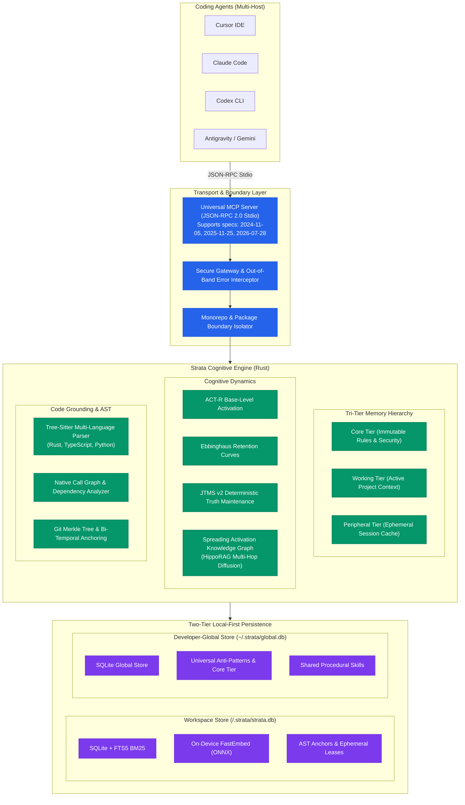

<div align="center">

# Strata

### The Local-First Persistent Memory Engine & Cognitive Runtime for AI Coding Agents

[](https://www.rust-lang.org/)
[-34D399.svg?style=flat-square)]()
[](https://modelcontextprotocol.io/)
[](https://www.sqlite.org/)
[]()
[-10B981.svg?style=flat-square)]()

<p align="center">
  <b>Strata</b> is a high-performance, deterministic external hippocampus written in pure Rust.<br/>
  It eliminates catastrophic forgetting, context window degradation, and cross-agent amnesia across<br/>
  <b>Cursor</b>, <b>Claude Code</b>, <b>Codex CLI</b>, <b>Gemini CLI</b>, and <b>Google Antigravity</b>.
</p>

[Quickstart](#-quickstart-in-60-seconds) •
[Architecture](#-system-architecture) •
[Why Strata?](#-why-strata-the-memory-paradox) •
[Core Pillars](#-core-engineering-pillars) •
[CLI Reference](#-cli-command-matrix) •
[Roadmap](#-2026-strategic-roadmap) •
[Contributing](CONTRIBUTING.md)

</div>

---

## ⚡ The Memory Paradox in AI Coding

Modern coding agents face a chronic structural limitation: **stateless amnesia between sessions and tools**.

```
❌ Traditional Approach: Naive Vector Dumps
Agent -> Scrapes entire file -> Vector DB dump -> High latency -> LLM hallucinations -> Stale / Contradictory rules

✅ The Strata Approach: Cognitive Hippocampus
Agent -> AST Tree-Sitter Anchor -> Git Merkle Diff -> JTMS v2 Deterministic Resolution -> Sub-10ms Context Injection
```

Most agent memory frameworks treat code like plain text — shoving raw strings into vector databases. This creates four fatal flaws:
1. **Semantic Hallucinations**: Embedding similarity cannot verify if an architectural fact is logically true or deprecated.
2. **Context Window Bloat**: Ineffective retrieval floods LLM prompts with hundreds of irrelevant tokens, increasing latency and costs.
3. **Stale Code Rot**: As files are refactored, renamed, or deleted, memory chunks point to non-existent code coordinates.
4. **Cloud Lock-in & Privacy Leaks**: Proprietary codebases and architectural secrets are shipped to third-party vector clouds.

**Strata solves this through mathematical cognitive science and native compiler-grade code analysis**:
- **ACT-R & Ebbinghaus Decay**: Active memories stay top-of-mind; unused details decay naturally without polluting prompts.
- **JTMS v2 (Justification-Based Truth Maintenance)**: Formal propositional logic resolves contradictions deterministically without asking an LLM.
- **Bi-Temporal AST Anchors**: Code facts anchor to syntax trees (Tree-Sitter) and Merkle commit hashes, surviving renames and refactors.
- **100% Local-First & Zero-Telemetry**: Runs on-device in `~/.strata/` with resident memory `< 10MB RAM` and retrieval `< 10ms`.

---

## 🏛️ System Architecture



---

## 🚀 Quickstart in 60 Seconds

### 1. Installation

#### One-Line Universal Install (Zero Prerequisites)
```bash
# macOS and Linux
curl -fsSL https://raw.githubusercontent.com/phfarath/Strata/main/install.sh | bash

# Windows (PowerShell)
irm https://raw.githubusercontent.com/phfarath/Strata/main/install.ps1 | iex
```

#### Via Cargo
```bash
# Instant pre-built binary (< 5s via cargo-binstall)
cargo binstall strata-cli

# Or compile from source
cargo install strata-cli
```

*Pre-built standalone binaries for all platforms (Linux x86_64/arm64, macOS Apple Silicon/Intel, Windows x64) are also available in [GitHub Releases](https://github.com/phfarath/Strata/releases).*

### 2. Auto-Configure MCP in 1 Command
Automatically inject Strata into your installed coding agents (Cursor, Claude Desktop, Windsurf) without touching JSON files manually:
```bash
strata mcp install
```

### 3. Initialize in Your Repository
```bash
cd your-project
strata init
```
This scaffolds the local `.strata/` cache, enables SQLite WAL mode, and compiles multi-host rule adapters.

### 4. Real-Time Terminal Observability (TUI)
Inspect cognitive health, ACT-R memory decay curves, failure defense radar, JTMS v2 belief trees, and AST code anchors in an interactive terminal dashboard:
```bash
strata ui
```

### (Optional) Manual MCP Configuration

Strata serves native Model Context Protocol (MCP) tools directly over stdio:

#### Cursor (`~/.cursor/mcp.json` or `.cursor/mcp.json`)
```json
{
  "mcpServers": {
    "strata": {
      "command": "strata",
      "args": ["mcp"]
    }
  }
}
```

#### Claude Desktop / Claude Code (`claude_desktop_config.json`)
```json
{
  "mcpServers": {
    "strata": {
      "command": "strata",
      "args": ["mcp"]
    }
  }
}
```

#### Google Antigravity
```bash
agy mcp add strata -- strata mcp
```

---

## 🧠 Core Engineering Pillars

### 1. Bi-Temporal Code Anchoring (Tree-Sitter + Git Merkle Tree)
Traditional memory stores line numbers that break on the next commit. Strata calculates **structural AST node hashes** and anchors them to Git Merkle trees:
- When code is refactored or moved, Strata matches the symbol's BLAKE3 AST hash.
- Run `strata reconcile` to review stale, suspicious, or relocated facts across the workspace.

### 2. JTMS v2 Deterministic Truth Maintenance
When an agent learns a new rule that contradicts an older premise (e.g. *"Migrate REST handlers to gRPC"* vs *"Use Axum REST endpoints"*):
- **Zero Hallucination Arbitration**: Instead of asking an LLM to "decide", JTMS checks premise justifications.
- **Cascading Invalidation**: Deprecating node $A$ automatically transitions all downstream dependent facts to `OUT` state without leaving orphaned beliefs.

### 3. Mathematical Cognitive Dynamics (ACT-R + Ebbinghaus)
Memory activation follows the ACT-R cognitive architecture equation:

$$A_m = \alpha \ln\left(\sum_{k=1}^n t_k^{-d}\right) + \beta I_m + \gamma C_m + \lambda F_m$$

And stability follows the spaced-repetition retention curve:

$$R_m(t) = \exp\left(-\frac{t}{S_m}\right)$$

- Memories accessed repeatedly become durable long-term facts.
- Transient conversational context naturally decays and is pruned via `strata prune --threshold 0.2`.

### 4. Tri-Tier Memory Model
- **Core Tier**: Foundational project invariants and security rules. Protected by **Human-in-the-Loop (HITL)** approval before promotion or deletion.
- **Working Tier**: Active sprint and feature knowledge. Scoped to monorepo package boundaries.
- **Peripheral Tier**: Ephemeral session notes and raw tool traces with high decay rates.

### 5. Autonomous Preference Mining (DPO / KTO / SFT)
Strata turns everyday developer-agent iterations into fine-tuning datasets:
- Intercepts failed tool attempts (`rejected`) and subsequent successful fixes (`chosen`).
- Exports ready-to-train datasets for Unsloth, TRL, and Axolotl:
  ```bash
  strata export --format dpo --out dpo_dataset.jsonl
  strata export --format kto --out kto_dataset.jsonl
  strata export --format sft --out sft_skills.jsonl
  ```

### 6. Spreading Activation Knowledge Graph (HippoRAG / ACT-R)
Deterministic multi-hop associative memory recall without LLM tokens:
- Construct a fast in-memory adjacency graph linking memories, semantic facts, symbols, files, and concepts.
- Diffuses energy across edges ($\Delta A_t(v) = \sum A_{t-1}(u) \cdot w \cdot \lambda$) with self-retention and hop attenuation.
- Tri-Modal Reciprocal Rank Fusion (RRF) fuses BM25 lexical precision, vector semantic similarity, and knowledge graph activation to discover associative context with 0 keyword overlap.

### 7. Two-Tier Storage & Cross-Project Federation
Clean segregation of concerns across developer environments:
- **Workspace Store** (`<workspace>/.strata/strata.db`): Ephemeral agent leases, raw episodic logs, AST anchors, and commit hashes.
- **Developer-Global Store** (`~/.strata/global.db`): Reusable compiler anti-patterns, procedural skills, and Core Tier axioms shared across all projects on your machine.
- Seamless dual-store querying with Reciprocal Rank Fusion and selective transfer:
  ```bash
  strata promote --id <UUID> --to-global
  strata transfer --from /path/to/other-project --tier core
  ```

---

## 💻 CLI Command Matrix

| Command | Purpose | Example |
| :--- | :--- | :--- |
| `strata init` | Scaffold local SQLite database and agent instructions | `strata init` |
| `strata mcp` | Launch the universal JSON-RPC Stdio MCP Server | `strata mcp` |
| `strata mcp install` | Auto-configure MCP in Cursor, Claude Desktop, and Windsurf | `strata mcp install` |
| `strata mcp uninstall` | Safely remove Strata from host editor configs | `strata mcp uninstall` |
| `strata search` | Hybrid Reciprocal Rank Fusion (FTS5 BM25 + FastEmbed + Graph) | `strata search "auth middleware" --graph` |
| `strata get` | Retrieve full memory record by UUID | `strata get --id <UUID>` |
| `strata write` | Write a memory record directly from the command line | `strata write --content "Rule..."` |
| `strata promote` | Human-in-the-loop approval & promotion to Core Tier / Global | `strata promote --id <UUID> --to-global` |
| `strata transfer` | Cross-project knowledge transfer from another repository | `strata transfer --from ../other-repo` |
| `strata config` | Manage runtime configuration and reasoning providers | `strata config set provider ollama` |
| `strata consolidate` | Distill episodic traces with pluggable reasoning engine | `strata consolidate --provider ollama` |
| `strata a2a` | Multi-agent stigmergic presence and atomic temporal leases | `strata a2a status` |
| `strata remember` | Store a semantic fact, anti-pattern, or architectural decision | `strata remember "Never bypass JWT auth"` |
| `strata reconcile` | Scan workspace against Git Merkle tree to detect relocated/stale code | `strata reconcile --auto-relink` |
| `strata digest` | Generate high-level architectural overview and community clusters | `strata digest` |
| `strata prune` | Apply ACT-R decay curves to purge expired peripheral memories | `strata prune --threshold 0.2` |
| `strata export` | Export trajectory pairs for LLM fine-tuning (DPO, KTO, SFT) | `strata export --format dpo` |
| `strata blast-radius` | Causal blast radius analysis and ripple effect assessment | `strata blast-radius --file src/auth.rs` |
| `strata plan` | Hierarchical goal DAG decomposition and wave execution | `strata plan "Implement oauth"` |
| `strata train` | One-click local LoRA fine-tuning via Unsloth and Ollama | `strata train --dataset dpo.jsonl` |
| `strata callgraph` | Native deterministic call graph & import dependency analyzer | `strata callgraph --path crates/` |
| `strata workspace` | Multi-package monorepo workspace boundary isolator | `strata workspace detect` |
| `strata architecture` | Graph community detection & architectural clustering | `strata architecture` |
| `strata ui` | Interactive terminal dashboard (TUI) with real-time metrics | `strata ui` |
| `strata doctor` | Verify integrity of SQLite database, FTS5 indexes, and MCP config | `strata doctor` |

---

## 🗺️ 2026 Strategic Roadmap

```text
┌──────────────────────────────────────────────────────────────────────────────────┐
│                             STRATA ROADMAP 2026                                  │
├───────────────────────┬──────────────────────────┬───────────────────────────────┤
│ MILESTONE             │ STATUS                   │ DELIVERABLE                   │
├───────────────────────┼──────────────────────────┼───────────────────────────────┤
│ Phase 0 — Scaffolding │ ✅ Complete (v0.1.0-a1)   │ Rust runtime, SQLite, ACT-R   │
│ Phase 1 — Grounding   │ ✅ Complete (v0.1.0-b2)   │ Tree-Sitter AST, Merkle Tree  │
│ Phase 2 — Truth Maint │ ✅ Complete (v0.1.0-rc1)  │ JTMS v2, Call Graph, Monorepo │
│ Phase 3 — Open Core   │ ✅ Complete (v0.1.0)      │ Pure Open-Core, 105 tests     │
│ Phase 4 — A2A Leases  │ ✅ Complete (v0.1.1)      │ Stigmergic Leases, Discovery  │
│ Phase 5 — Auto-Consol │ ✅ Complete (v0.1.1)      │ Neuro-Symbolic Consolidator   │
│ Phase 6 — Graph Recall│ ✅ Complete (v0.1.1)      │ Spreading Activation HippoRAG │
│ Phase 7 — Federation  │ ✅ Complete (v0.1.1)      │ Dual-Tier Global & Transfer   │
│ Phase 8 — Local IPC   │ 🔄 In Progress (Q4 2026) │ Realtime UDS / Named Pipe Bus │
└───────────────────────┴──────────────────────────┴───────────────────────────────┘
```

- **Phase 6: Spreading Activation Knowledge Graph (HippoRAG / ACT-R)**: Associative multi-hop recall diffusing energy across semantic facts, AST anchors, and call graph edges with zero token cost.
- **Phase 7: Two-Tier Memory Federation & Global Knowledge Transfer**: Local workspace isolation (`<workspace>/.strata/strata.db`) federated with developer-global rules and anti-patterns (`~/.strata/global.db`).
- **Phase 8: Realtime Local IPC & Stigmergic Event Bus**: Sub-millisecond local Unix Domain Socket / Named Pipe IPC allowing Cursor, Claude Code, OpenCode, and Antigravity to coordinate leases and anti-patterns in real time on the same machine.

---

## ☁️ Strata Cloud (Team Collaboration)

Working with a team or across multiple machines? **[Strata Cloud](https://github.com/phfarath/strata-cloud)** extends Strata with managed cloud capabilities:
- **Team Memory**: Synchronize memory entities and AST anchors across all developers on your team.
- **Realtime CDC Relay**: Live multi-device synchronization over WebSockets and PostgreSQL 16 + pgvector.
- **Cloud Dashboard**: Visual knowledge graph, audit trail, workspace quotas, and role-based access control (RBAC).

---

## 🤝 Contributing

Contributions make the open-source community thrive! Please check our **[CONTRIBUTING.md](CONTRIBUTING.md)** for our engineering philosophy, code style, and test guidelines.

---

## 📜 License

Strata is dual-licensed under either:
- **MIT License** ([LICENSE-MIT](LICENSE-MIT))
- **Apache License, Version 2.0** ([LICENSE-APACHE](LICENSE-APACHE))

at your option.
