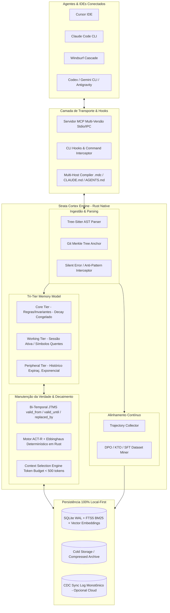

# Strata Cortex — Especificação Arquitetural Completa & Integração MCP

> **Visão Geral**: Este documento consolida a arquitetura completa do **Strata Cortex**, integrando todas as inovações, resoluções de dores e vantagens competitivas mapeadas no benchmarking de mercado (Mem0, Supermemory, Zep/Graphiti, Letta, LangMem, Cursor, Claude Code e Windsurf).

---

## 🏛️ 1. Macroarquitetura do Sistema



---

## 🧠 2. O Modelo Cognitivo de 3 Camadas (Tri-Tier Memory Model)

Diferente dos concorrentes que tratam todas as memórias com o mesmo peso, o Strata implementa **três tiers estritos de retenção e relevância**:

| Tier | Escopo | Dinâmica de Decaimento | Token Budget | Destino na Expiração |
| :--- | :--- | :--- | :--- | :--- |
| **1. Core Tier** | Diretrizes fundamentais do projeto, regras de segurança, invariantes de arquitetura e constraints críticas. | $\alpha = 0$ (Decaimento congelado, retenção permanente $1.0$). | Até 150 tokens | Nunca expira (apenas atualizado via JTMS). |
| **2. Working Tier** | Símbolos, arquivos tocados, comandos recentes, diffs e contexto imediato da tarefa ativa. | Recência imediata (FIFO + Saliência de Tarefa). Reseta no final da sessão. | Até 250 tokens | Destilado para Semântico/Procedural ou descartado. |
| **3. Peripheral Tier** | Histórico conversacional, decisões contextuais passadas, logs de depuração e fatos secundários. | Decaimento exponencial $R(t) = \exp(-t/S_m)$ via ACT-R e Ebbinghaus. | Restante do Budget (Rankeado por score) | Arquivado para Cold Storage compactado em disco quando score $< \theta_{prune}$. |

---

## 🔍 3. AST Parsing Nativo & Ancoragem Git Merkle Tree

Para eliminar a desvantagem de motores genéricos (que tratam código como texto solto), o Strata ancora memórias diretamente na estrutura de código:

### 3.1 Identificador Universal de Símbolo (`SymbolPath`)
Toda memória gerada a partir do código recebe um ponteiro estruturado:
```rust
pub struct CodeAnchor {
    pub file_path: String,          // ex: "crates/strata-memory/src/store.rs"
    pub symbol_path: String,        // ex: "strata_memory::store::MemoryStore::search"
    pub symbol_type: SymbolType,    // Function | Struct | Trait | Module | Const
    pub git_commit_hash: String,    // Hash Merkle no momento da criação
    pub ast_node_hash: String,      // Hash do nó Tree-Sitter (detecta refatoração mesmo com commit novo)
}
```

### 3.2 Validação Bi-Temporal via Merkle Tree
1. Quando um arquivo é modificado, o parser Tree-Sitter extrai os nós alterados em $< 5\text{ms}$.
2. Se o `ast_node_hash` do símbolo mudou, a memória associada recebe um timestamp de `valid_until = now()` e o JTMS dispara uma re-validação ou marcação de obsolescência, impedindo que o agente alucine contratos de funções que já mudaram.

---

## 🛑 4. Memória Negativa & Captura Silenciosa de Anti-Padrões (O Maior Gap de Mercado)

O Strata intercepta comandos de terminal e ferramentas para **garantir que nenhum agente repita o mesmo erro**:

### Schema de Memória Negativa (`AntiPattern`):
```json
{
  "id": "anti_rust_dyn_port_8192",
  "type": "AntiPattern",
  "category": "DeploymentFailure",
  "target_context": "railway.toml::deploy",
  "failed_attempt": {
    "command": "cargo run --bin strata-cli",
    "diff_or_config": "PORT = 8080 (static binding)",
    "error_log": "Error: Address already in use / dynamic PORT required by orchestrator"
  },
  "actionable_constraint": "DO NOT hardcode PORT 8080. Always bind dynamically to std::env::var(\"PORT\").",
  "confidence": 0.98,
  "decay_frozen": true,
  "created_at": 1755645934
}
```

### Injeção Preempitiva de Baixo Custo (< 50 tokens):
Quando o agente inicia uma tarefa relacionada a `deploy` ou toca no `railway.toml`, o Strata injeta diretamente no prompt:
> `[KNOWN ANTI-PATTERN]: DO NOT hardcode PORT 8080. Always bind dynamically to std::env::var("PORT"). (Triggered by: railway.toml)`

---

## ⚖️ 5. JTMS Bi-Temporal & Resolução de Contradições

O Strata gerencia o ciclo de vida da verdade através do modelo bi-temporal integrado com JTMS:

```text
       Tempo do Mundo Real (Validade da Regra de Negócio)
  ├───────────────────────────────┼───────────────────────────────►
  [Regra V1: REST API]             [Regra V2: gRPC + Protobuf]
  valid_from: 2025-01-01          valid_from: 2026-08-19
  valid_until: 2026-08-19         valid_until: ∞
  Status: OUT (Deprecated)        Status: IN (Active)
              │                               ▲
              └──────── replaced_by ──────────┘
```

- **Tempo Transacional**: Gravado no SQLite com `created_at` imutável.
- **Tempo Válido**: `valid_from` e `valid_until` controlam se a diretriz é historicamente auditável ou ativamente injetada no prompt atual.

---

## 📊 6. Motor Determinístico de Decaimento (Zero Token Overhead)

Em vez de pagar chamadas de LLM para ranquear memórias, o Cortex calcula a saliência cognitiva em microssegundos:

$$\text{FinalScore}(m) = w_v \cdot \text{Sim}_{\text{cos}}(q, m) + w_b \cdot \text{BM25}(q, m) + w_a \cdot A_m(t) + w_e \cdot R_m(t) + w_p \cdot \mathbb{I}_{\text{AntiPattern}}$$

Onde:
- $A_m(t) = \alpha \ln\left(\sum_{k=1}^n t_k^{-d}\right) + \beta I_m + \gamma C_m$ (Ativação ACT-R)
- $R_m(t) = \exp\left(-\frac{t}{S_m}\right)$ (Retenção Ebbinghaus)
- $\mathbb{I}_{\text{AntiPattern}}$: Boost multiplicativo imediato se for um guardrail negativo para o contexto atual.

---

## 🤖 7. Mineração Autônoma de Datasets de Alinhamento (DPO / KTO / SFT)

O Strata transforma a atividade de codificação do dia a dia em pares de preferência de alta qualidade:

```text
Agent Session #409 (Bugfix in Memory Cache)
 ├── Tentativa 1: Mutex<HashMap> -> Deadlock em thread assíncrona (cargo test FALHOU)
 ├── Tentativa 2: RwLock<HashMap> -> Data race em escrita concorrente (cargo test FALHOU)
 └── Tentativa 3: DashMap / ArcSwap -> 100% dos testes passaram (cargo test PASSOU)
```

**Resultado minerado automaticamente para `dpo_dataset.jsonl`:**
```json
{
  "prompt": "Implement high-concurrency read-heavy memory cache for Strata in Rust",
  "chosen": "pub struct MemoryCache { inner: Arc<DashMap<MemoryId, MemoryRecord>> } // Uses lock-free read-paths",
  "rejected": "pub struct MemoryCache { inner: Arc<Mutex<HashMap<MemoryId, MemoryRecord>>> } // Causes async worker deadlocks",
  "metadata": {
    "source": "execution_session_409",
    "verified_by": "cargo test --package strata-memory",
    "timestamp": 1755645934
  }
}
```

---

## 🔌 8. Especificação das 5 Ferramentas MCP Universais

O servidor MCP (`strata-cli mcp`) expõe o Cortex com contratos estritos:

```json
[
  {
    "name": "memory_search",
    "description": "Busca híbrida (Vetorial + FTS5 BM25 + Grafo) filtrada por relevância cognitiva e budget de tokens.",
    "parameters": {
      "query": "string",
      "limit": "integer (default 5)",
      "tier": "Core | Working | Peripheral | All",
      "include_anti_patterns": "boolean (default true)"
    }
  },
  {
    "name": "memory_get",
    "description": "Recupera o registro atômico com grafo de evidências, justificação JTMS e proveniência causal.",
    "parameters": {
      "id": "string"
    }
  },
  {
    "name": "memory_write",
    "description": "Grava uma nova memória (Semântica, Procedural, Anti-Padrão ou Regra de Projeto) com ancoragem opcional de AST.",
    "parameters": {
      "content": "string",
      "memory_type": "Semantic | Procedural | AntiPattern | CoreRule",
      "confidence": "number (0.0 to 1.0)",
      "symbol_path": "string (optional)",
      "replaces_id": "string (optional, triggers JTMS deprecation)"
    }
  },
  {
    "name": "memory_digest",
    "description": "Gera um resumo compacto e compilado do contexto ideal para a tarefa atual, respeitando o token budget.",
    "parameters": {
      "current_task": "string",
      "active_files": "array of strings",
      "token_budget": "integer (default 400)"
    }
  },
  {
    "name": "memory_feedback",
    "description": "Registra reforço cognitivo (útil / inútil / causou erro) ajustando a estabilidade Ebbinghaus e ACT-R do chunk.",
    "parameters": {
      "memory_id": "string",
      "outcome": "Success | Failure | Rejected"
    }
  }
]
```

---

## 🎯 9. Roadmap de Implementação das Novas Capacidades no Strata

1. [x] **Core Engine em Rust & SQLite WAL**: Implementado e validado (`strata-core`, `strata-memory`).
2. [x] **JTMS Belief Revision & ACT-R**: Implementado com 49/49 testes passando.
3. [x] **DPO / KTO Preference Miner**: Pipeline de extração estruturado.
4. [ ] **Tree-Sitter AST & Merkle Hash Anchor**: Adicionar crate/módulo para indexação estrutural de símbolos.
5. [ ] **Classificação Estrita de 3 Tiers**: Formalizar os tiers *Core*, *Working* e *Peripheral* com rotina de cold storage no comando `strata prune`.
6. [ ] **Command Interceptor Middleware**: Criar hook de shell (`strata hook wrap -- <cmd>`) para capturar automaticamente falhas de build e gravar `AntiPatterns`.
