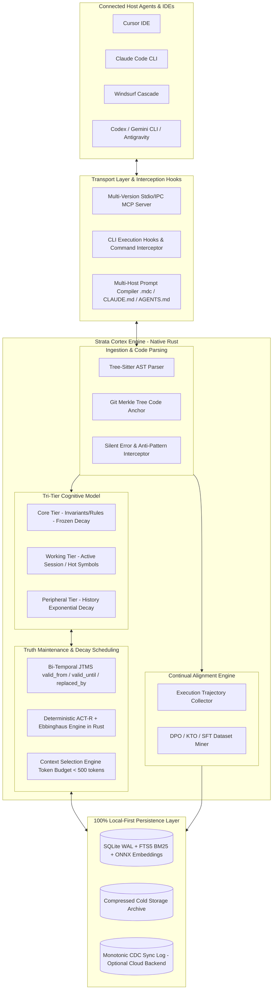

# Strata Cortex — Complete Architectural Specification & MCP Integration

> **Executive Overview**: This document consolidates the complete architectural specification of **Strata Cortex**, unifying the innovations, pain-point resolutions, and competitive differentiators mapped during cross-industry benchmarking (Mem0, Supermemory, Zep/Graphiti, Letta, LangMem, Cursor, Claude Code, and Windsurf).

---

## 1. System Macroarchitecture



---

## 2. Tri-Tier Cognitive Memory Model

Unlike naive memory solutions that assign equal retrieval weight to all stored facts, Strata implements a **tri-tier cognitive memory hierarchy** governing retention, salience, and eviction dynamics:

| Memory Tier | Architectural Scope | Decay Dynamics | Token Budget | Eviction / Archival Policy |
| :--- | :--- | :--- | :--- | :--- |
| **1. Core Tier** | Fundamental project directives, security baselines, architectural invariants, and mission-critical constraints. | $\alpha = 0$ (Frozen decay; permanent retention score $1.0$). | Up to 150 tokens | Never evicts; updated strictly via formal JTMS belief revision. |
| **2. Working Tier** | Active symbols, recently touched file paths, current execution traces, git diffs, and immediate task context. | Task-dependent recency (FIFO queue + task-salience multiplier; flushes at session termination). | Up to 250 tokens | Distilled into Semantic/Procedural records or safely pruned. |
| **3. Peripheral Tier** | Conversational history, past contextual decisions, auxiliary debug outputs, and secondary facts. | Deterministic exponential decay $R(t) = \exp(-t/S_m)$ via ACT-R and Ebbinghaus functions. | Remainder of Budget (Ranked dynamically by salience score) | Evicted to compressed on-disk Cold Storage when score $< \theta_{\text{prune}}$. |

---

## 3. Native AST Parsing & Git Merkle Tree Anchoring

To eliminate the fundamental defect of generic memory engines—which treat source code as unformatted, drifting natural language chunks—Strata anchors code-derived memories directly to abstract syntax tree nodes and Git Merkle trees.

### 3.1 Universal Symbol Identifier (`SymbolPath`)
Every memory record derived from or referencing codebase entities receives a structured cryptographic pointer:

```rust
pub struct CodeAnchor {
    pub file_path: String,          // e.g., "crates/strata-memory/src/store.rs"
    pub symbol_path: String,        // e.g., "strata_memory::store::MemoryStore::search"
    pub symbol_type: SymbolType,    // Function | Struct | Trait | Module | Const
    pub git_commit_hash: String,    // Merkle commit hash at anchor creation
    pub ast_node_hash: String,      // Tree-Sitter AST hash (detects refactorings across commits)
}
```

### 3.2 Bi-Temporal Validation via Merkle Tree Invalidation
1. When a source file is altered, the Tree-Sitter parser extracts modified AST node hashes in $< 5\text{ms}$.
2. If the `ast_node_hash` for a symbol diverges from its recorded anchor, the associated memory record is assigned a validity boundary of `valid_until = now()`. The JTMS triggers an automatic deprecation warning or re-verification cycle, preventing connected agents from hallucinating deprecated function signatures or obsolete architectural contracts.

---

## 4. Negative Memory & Silent Anti-Pattern Interception

Software engineering agents routinely repeat documented failures across distinct conversational sessions. Strata intercepts terminal and tool execution pipelines to capture structured failure modes, preventing identical regressions across agent runs.

### Negative Memory Schema (`AntiPattern`):
```json
{
  "id": "anti_rust_dyn_port_8192",
  "type": "AntiPattern",
  "category": "DeploymentFailure",
  "target_context": "railway.toml::deploy",
  "failed_attempt": {
    "command": "cargo run --bin strata-cli",
    "diff_or_config": "PORT = 8080 (static binding)",
    "error_log": "Error: Address already in use / dynamic PORT required by orchestrator"
  },
  "actionable_constraint": "DO NOT hardcode PORT 8080. Always bind dynamically to std::env::var(\"PORT\").",
  "confidence": 0.98,
  "decay_frozen": true,
  "created_at": 1755645934
}
```

### Preemptive Low-Overhead Injection (< 50 tokens):
When an agent initiates an action involving deployment workflows or modifies `railway.toml`, Strata injects an immediate, high-priority constraint directly into the prompt context:
> `[KNOWN ANTI-PATTERN]: DO NOT hardcode PORT 8080. Always bind dynamically to std::env::var("PORT"). (Triggered by: railway.toml)`

---

## 5. Bi-Temporal JTMS & Deterministic Contradiction Resolution

Strata models belief lifecycles through a formal bi-temporal framework integrated with a Justification-based Truth Maintenance System (JTMS):

```text
       Real-World Valid Time (Domain Rule Validity)
  ├───────────────────────────────┼───────────────────────────────►
  [Rule V1: REST API]             [Rule V2: gRPC + Protobuf]
  valid_from: 2025-01-01          valid_from: 2026-08-19
  valid_until: 2026-08-19         valid_until: ∞
  Status: OUT (Deprecated)        Status: IN (Active)
              │                               ▲
              └──────── replaced_by ──────────┘
```

- **Transaction Time**: Immutable record timestamp stored in SQLite (`created_at`).
- **Valid Time**: Interval defined by `valid_from` and `valid_until` determining whether an engineering rule is historically preserved for compliance/audits or actively eligible for live prompt injection.

---

## 6. Deterministic Decay Engine (Zero Token Overhead)

Rather than consuming costly LLM inference calls to score memory relevance, Cortex calculates cognitive salience in microseconds on pure CPU:

$$\text{FinalScore}(m) = w_v \cdot \text{Sim}_{\text{cos}}(q, m) + w_b \cdot \text{BM25}(q, m) + w_a \cdot A_m(t) + w_e \cdot R_m(t) + w_p \cdot \mathbb{I}_{\text{AntiPattern}}$$

Where:
- $A_m(t) = \alpha \ln\left(\sum_{k=1}^n t_k^{-d}\right) + \beta I_m + \gamma C_m$ (ACT-R base-level cognitive activation)
- $R_m(t) = \exp\left(-\frac{t}{S_m}\right)$ (Ebbinghaus memory retention curve)
- $\mathbb{I}_{\text{AntiPattern}}$: Immediate multiplicative boost applied whenever a guardrail pattern matches the current task context.

---

## 7. Autonomous Alignment Dataset Mining (DPO / KTO / SFT)

Strata converts ambient developer execution traces into gold-standard preference pairs without human labeling overhead:

```text
Agent Execution Trajectory #409 (Bugfix in Memory Cache)
 ├── Attempt 1: Mutex<HashMap> -> Deadlock in async worker thread (cargo test FAILED)
 ├── Attempt 2: RwLock<HashMap> -> Data race during concurrent writes (cargo test FAILED)
 └── Attempt 3: DashMap / ArcSwap -> 100% tests passed (cargo test PASSED)
```

**Mined Preference Pair Exported to `dpo_dataset.jsonl`:**
```json
{
  "prompt": "Implement high-concurrency read-heavy memory cache for Strata in Rust",
  "chosen": "pub struct MemoryCache { inner: Arc<DashMap<MemoryId, MemoryRecord>> } // Uses lock-free read-paths",
  "rejected": "pub struct MemoryCache { inner: Arc<Mutex<HashMap<MemoryId, MemoryRecord>>> } // Causes async worker deadlocks",
  "metadata": {
    "source": "execution_session_409",
    "verified_by": "cargo test --package strata-memory",
    "timestamp": 1755645934
  }
}
```

---

## 8. Specification of the 5 Universal MCP Tools

The Strata MCP server (`strata-cli mcp`) exposes the Cortex engine via strict JSON-RPC contracts:

```json
[
  {
    "name": "memory_search",
    "description": "Hybrid multi-modal search (Vector + FTS5 BM25 + Graph) filtered by cognitive salience and strict token budget constraints.",
    "parameters": {
      "query": "string",
      "limit": "integer (default 5)",
      "tier": "Core | Working | Peripheral | All",
      "include_anti_patterns": "boolean (default true)"
    }
  },
  {
    "name": "memory_get",
    "description": "Retrieves an atomic memory record with evidence graph, JTMS justification dependencies, and causal provenance links.",
    "parameters": {
      "id": "string"
    }
  },
  {
    "name": "memory_write",
    "description": "Persists a new memory record (Semantic, Procedural, AntiPattern, or CoreRule) with optional Tree-Sitter AST code anchoring.",
    "parameters": {
      "content": "string",
      "memory_type": "Semantic | Procedural | AntiPattern | CoreRule",
      "confidence": "number (0.0 to 1.0)",
      "symbol_path": "string (optional)",
      "replaces_id": "string (optional, triggers JTMS deprecation)"
    }
  },
  {
    "name": "memory_digest",
    "description": "Synthesizes a compact, compiled context summary tailored to the active task, strictly adhering to the configured token budget.",
    "parameters": {
      "current_task": "string",
      "active_files": "array of strings",
      "token_budget": "integer (default 400)"
    }
  },
  {
    "name": "memory_feedback",
    "description": "Records empirical execution reinforcement (Success / Failure / Rejected), calibrating Ebbinghaus stability and ACT-R weights.",
    "parameters": {
      "memory_id": "string",
      "outcome": "Success | Failure | Rejected"
    }
  }
]
```

---

## 9. Capability Implementation Roadmap

1. [x] **Native Rust Core Engine & SQLite WAL**: Fully implemented and validated (`strata-core`, `strata-memory`).
2. [x] **JTMS Belief Revision & Deterministic ACT-R**: Validated with comprehensive test coverage (49/49 unit and integration tests passing).
3. [x] **DPO / KTO Preference Miner**: Trajectory extraction pipeline implemented.
4. [ ] **Tree-Sitter AST & Merkle Hash Anchor**: Structural symbol indexing module for code entity binding.
5. [ ] **Strict Tri-Tier Classification & Cold Storage**: Formalization of *Core*, *Working*, and *Peripheral* tiers with automated disk compaction in `strata prune`.
6. [ ] **Command Interceptor Middleware**: Shell execution wrapper (`strata hook wrap -- <cmd>`) to capture silent build/test failures and generate `AntiPatterns`.
